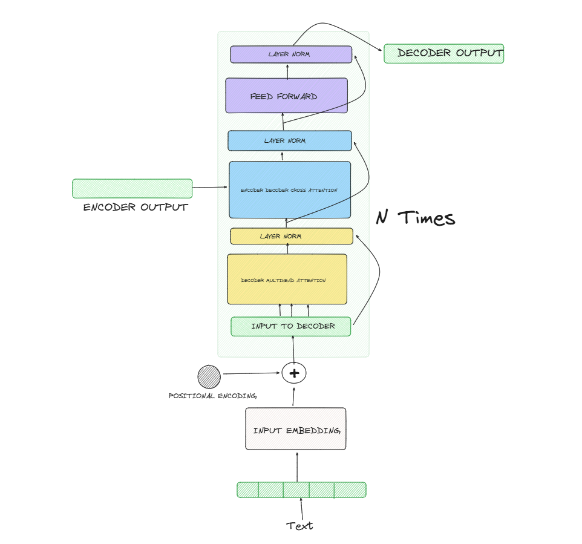

## Decoder Part Implementation

This folder contains the decoder part implementation from the paper attention is all you need.

[Decoder Part](./Transformer_Decoder.ipynb)

## What is covered in this folder:

- Input Embedding and Positional Encoding
- MultiHead Self attention
- Add and Norm Layer
- Feed Forward Neural Network
- Cross attention
