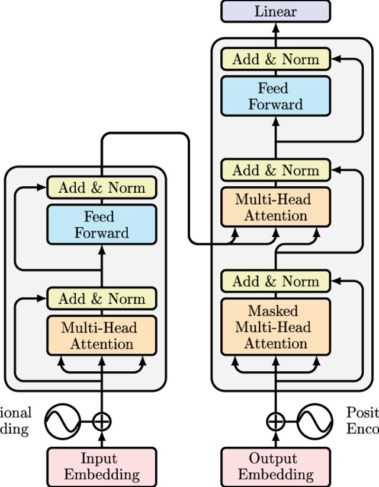

# Transformer Architecture: Encoder
From the paper attention is all you need here only encoder part is implemented which include:

- Input Token
- Embedding layer
- Self attention mechanism with multi head attention
- Residual connection with layer normalization
- Feed forward layer

