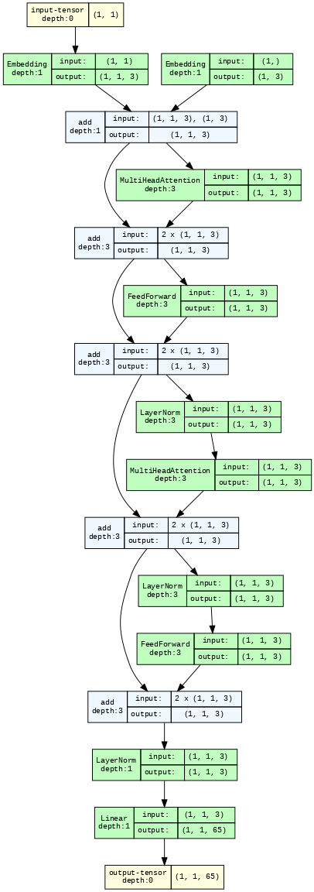

#  NanoGPT: Character level language modeling

A bigram language model using a Decode block trained on Shakespeare's data.

This is from the tutorial by **Andrej Karpathy**.

# model architecture

From the `**paper attention is all you need: Vashwani et. al**` implemented `Decoder` architecture for the nanoGPT.

### Implemented in this code:

- Position embedding
- Token Embedding
- MultiHead Self Attention
- FeedForward NN
- Layer Normalization
- Scaled dot product attention in self attentionn

### Configurations of the model

- batch_size = 4
- block_size : context size = 8
- embedding_size = 3
- head_size = 3
- dropout_rate = 0.1
- evaluation interval = 100
- num of head in attention = 1
- max iteration (epoch) = 1000
- learning_rate = 2e-4
- device: "cuda" or "cpu"
- evaluation iteration = 10
- n_layer = 1

### model diagram
- Input : [[1]] // in our vocab 1: " "
- Output: shape(1, 1, 65) i.e  65 prob for our vocab size of 65 for the next character prediction.

    

